<!-- <h1 align="center">
	2019년 2학기 수요일분반  
	임베디드 시스템 설계 및 실험 보고서  
	1조 3주차
</h1> -->

# 2019년 2학기 수요일분반

# 임베디드 시스템 설계 및 실험 보고서

# 1조 3주차

---

# 개요

Cortex-M3 보드를 사용하여 하드웨어 펌웨어 프로그래밍을 하는 실험이다.

DStream에서 JTAG을 통해 Cortex-M3 보드의 메모리에 펌웨어파일(.axf)을 업로드 할 수 있고 실시간 디버깅이 가능하다.

## 목표

- 임베디드 시스템의 기본 원리 습득
- 레지스터와 주소 제어를 통한 임베디드 펌웨어 개발 이해

## 세부실험내용

1. Datasheet 및 Reference Manual을 참고하여 해당 레지스터 및 주소에 대한 설정 이해

2. DS-5에서 프로젝트 생성 후 관련 설정 변경

3. USER SW를 이용하여 LED를 점멸할 수 있게 코드 작성

   USER S1: PD2, PD3 LED 번갈아가며 점멸(PD4, PD7 LED 꺼짐)

   USER S2: PD4, PD7 LED 번갈아가며 점멸(PD2, PD3 LED 꺼짐)

   Select: 모든 LED off

4. RAM에 올려 정상적인 동작 유무 확인

# 세팅

DS-5를 세팅하는 과정이다.

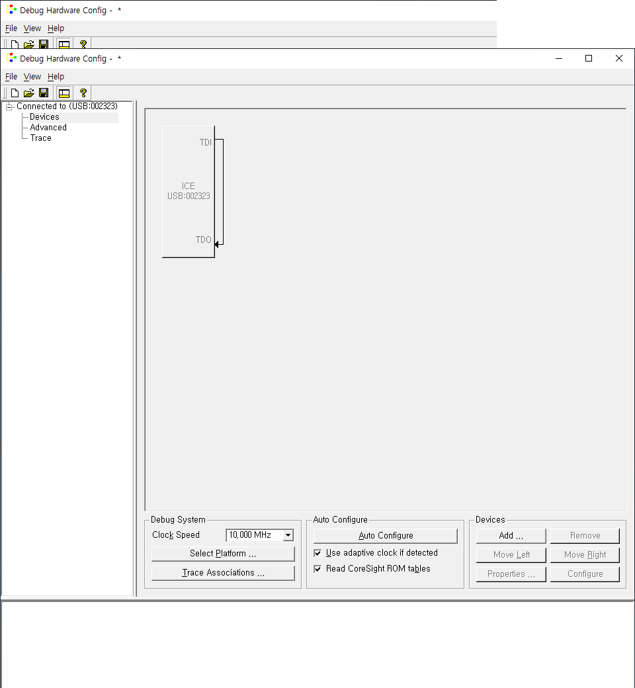

DStream을 JTAG을 사용해 Cortex-M3 보드와 연결하고 위와같이 Debug Hardware Config으로 하드웨어 설정을 한다.


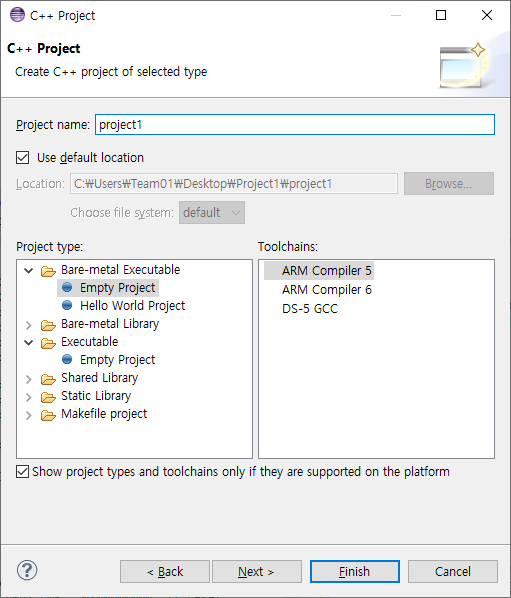

DS-5 프로젝트를 생성한다.

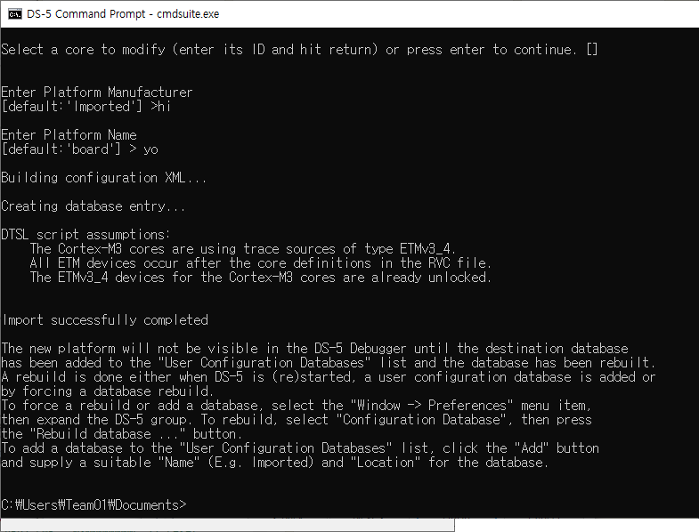

DS-5에서 사용할 데이터베이스를 cmd를 통해 설정한다.

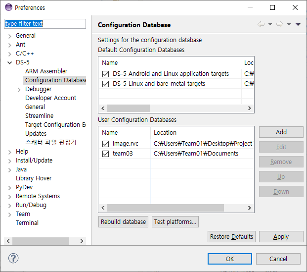

데이터베이스를 DS-5에서 설정한다.

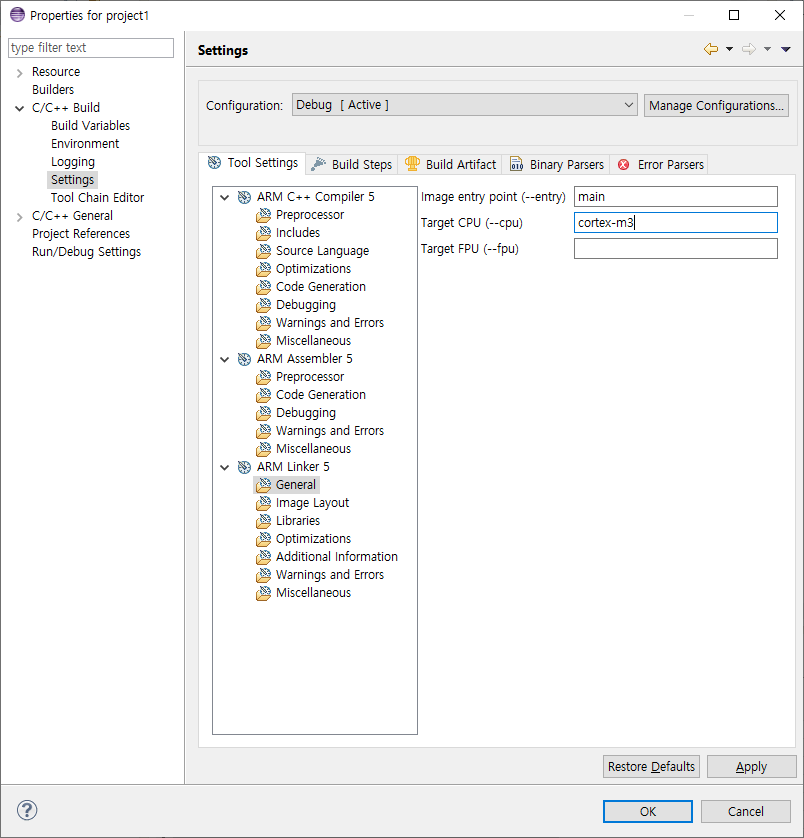

Cortex-M3 보드를 Target 으로 설정한다.

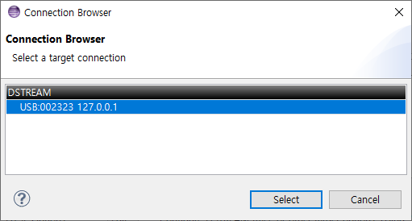

DStream이 정상적으로 연결되는지 확인한다.

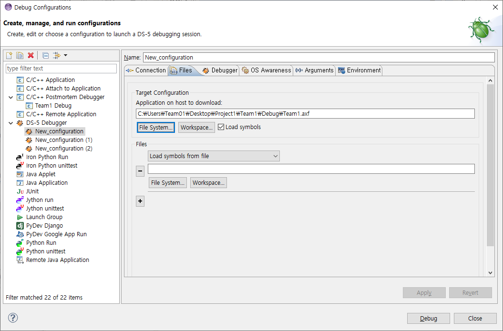

디버깅을 위해 보드 메모리에 업로드할 펌웨어파일(.axf)을 설정한다.

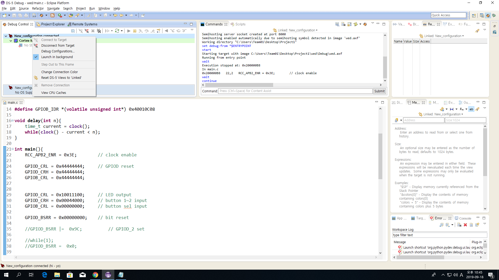

연결이 정상적으로 보여지는지 확인한다.

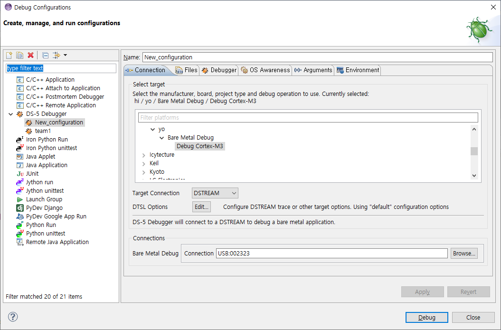

Debug Configuration에 들어가서 데이터베이스를 세팅한다.

다시 연결이 정상적으로 보여지는지 확인한다.

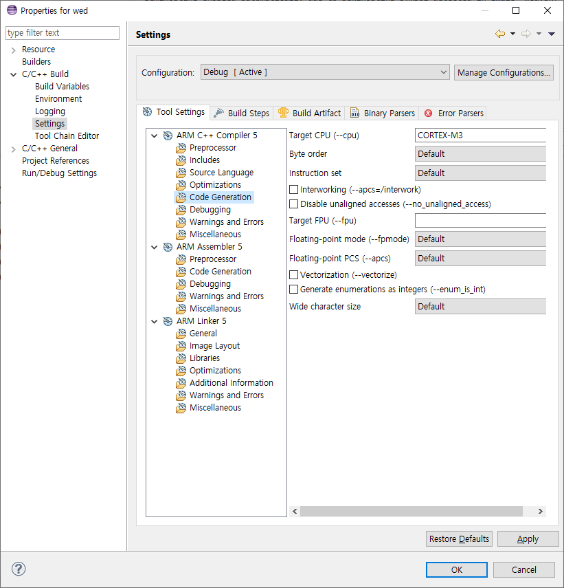

컴파일러의 Code Generation 옵션을 Cortex-M3로 설정한다.

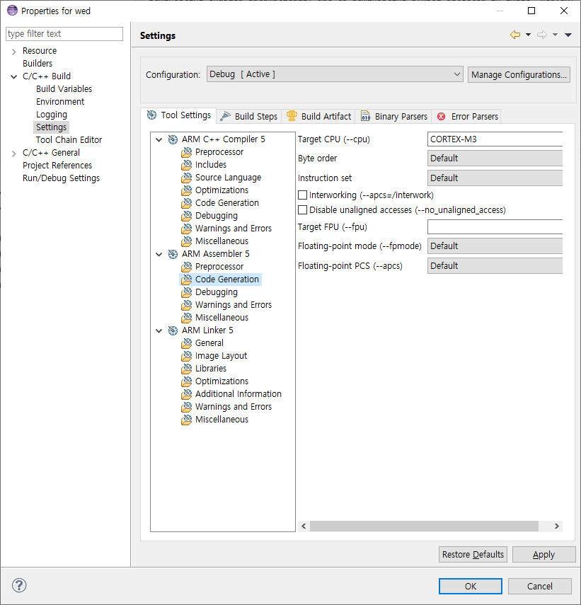

어셈블러의 Code Generation 옵션을 Cortex-M3로 설정한다.

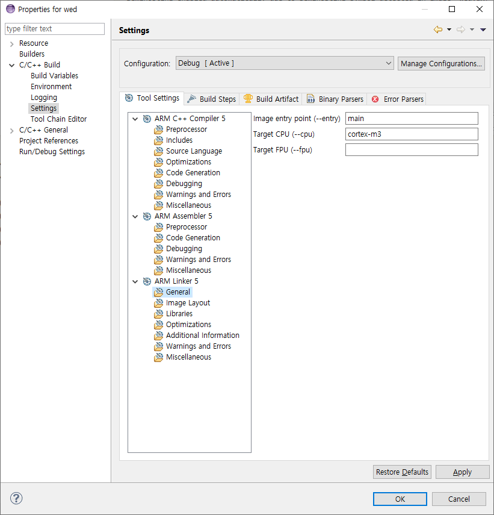

링커의 target-cpu를 Cortex-M3로 설정한다.

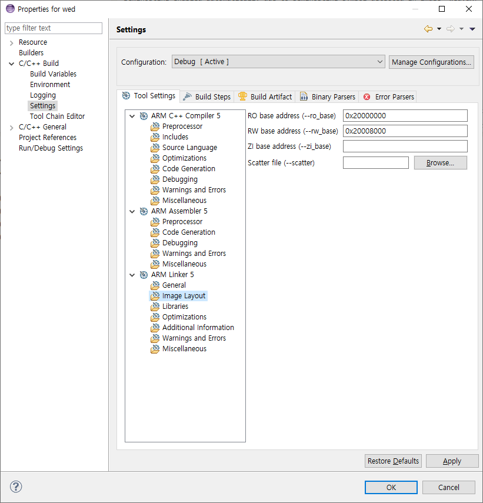

RO base address와 RW base address에 SRAM의 메모리 주소를 입력한다.

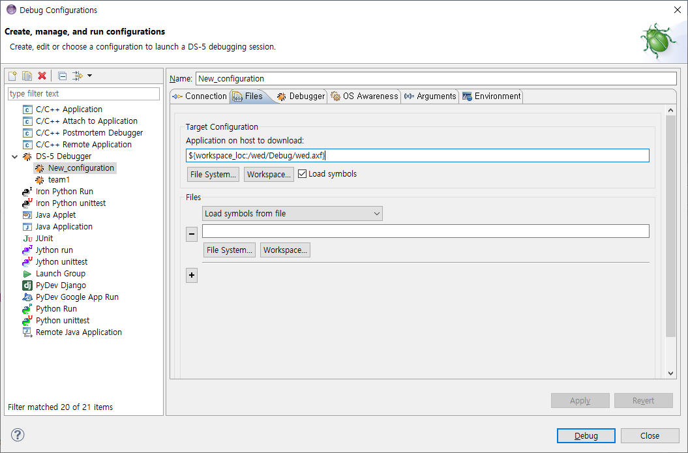

디버깅을 위해 보드 메모리에 업로드할 펌웨어파일(.axf)을 설정한다.

# 구현

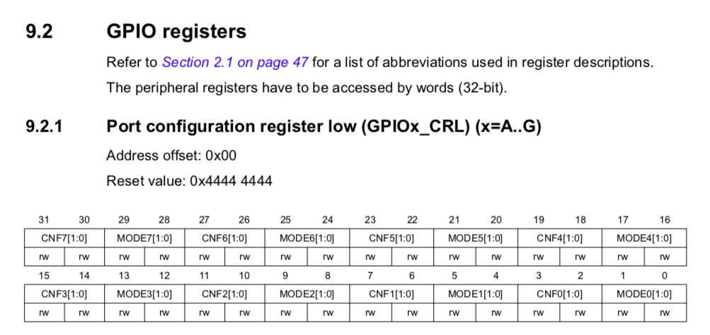

# 결론

ARM 보드를 처음 다루어보는터라 많이 헤맸다. 디버깅을 해도 펌웨어파일이 보드에 올라가질 않아 어려움을 느꼈으나 절차대로 차근차근 하니 해결되었다. Reference Manual과 Datasheet 리딩하는 방법을 좀 더 공부하여 익힐 필요성이 요구되었다. 다음 실험부터는 레퍼런스 리딩법을 더 숙지하여 어려움이 없도록 해야겠다.
