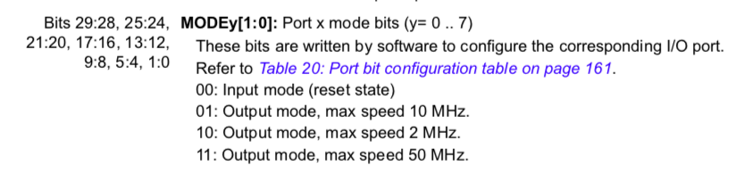
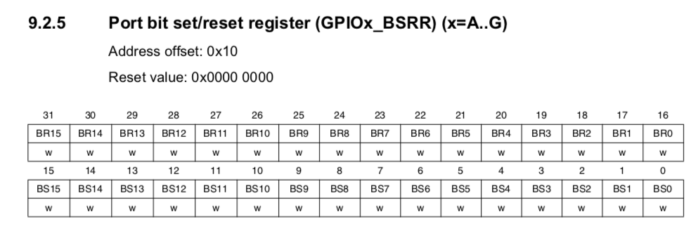

# 2019년 2학기 수요일분반

# 임베디드 시스템 설계 및 실험 보고서

# 1조 3주차


---


# 개요

Cortex-M3 보드를 사용하여 하드웨어 펌웨어 프로그래밍을 하는 실험이다.

DStream에서 JTAG을 통해 Cortex-M3 보드의 메모리에 펌웨어파일(.axf)을 업로드 할 수 있고 실시간 디버깅이 가능하다.

## 목표

- 임베디드 시스템의 기본 원리 습득
- 레지스터와 주소 제어를 통한 임베디드 펌웨어 개발 이해

## 세부실험내용

1. Datasheet 및 Reference Manual을 참고하여 해당 레지스터 및 주소에 대한 설정 이해

2. DS-5에서 프로젝트 생성 후 관련 설정 변경

3. USER SW를 이용하여 LED를 점멸할 수 있게 코드 작성

   USER S1: PD2, PD3 LED 번갈아가며 점멸(PD4, PD7 LED 꺼짐)

   USER S2: PD4, PD7 LED 번갈아가며 점멸(PD2, PD3 LED 꺼짐)

   Select: 모든 LED off

4. RAM에 올려 정상적인 동작 유무 확인

# 세팅

DS-5를 세팅하는 과정이다.


DStream을 JTAG을 사용해 Cortex-M3 보드와 연결하고 위와같이 Debug Hardware Config으로 하드웨어 설정을 한다.



DS-5 프로젝트를 생성한다.


DS-5에서 사용할 데이터베이스를 cmd를 통해 설정한다.


데이터베이스를 DS-5에서 설정한다.


Cortex-M3 보드를 Target 으로 설정한다.


DStream이 정상적으로 연결되는지 확인한다.


디버깅을 위해 보드 메모리에 업로드할 펌웨어파일(.axf)을 설정한다.


연결이 정상적으로 보여지는지 확인한다.


Debug Configuration에 들어가서 데이터베이스를 세팅한다.


다시 연결이 정상적으로 보여지는지 확인한다.


컴파일러의 Code Generation 옵션을 Cortex-M3로 설정한다.


어셈블러의 Code Generation 옵션을 Cortex-M3로 설정한다.


링커의 target-cpu를 Cortex-M3로 설정한다.


RO base address와 RW base address에 SRAM의 메모리 주소를 입력한다.


디버깅을 위해 보드 메모리에 업로드할 펌웨어파일(.axf)을 설정한다. 펌웨어파일은 .c로 코드를 작성하고 빌드하면 생성된다.


# 레퍼런스 보는법
## 흐름

LED를 켜고끄기 위한 전체적인 순서는 아래와 같다.

1. RCC(Reset and Clock Control) enable 
   
   GPIO핀의 클락을 맞춰주기 위해 RCC Register를 enable 한다

2. GPIOx output 

   GPIOx 핀을 output모드로 설정한다.

3. GPIOx reset 

   GPIOx 핀의 bit값을 초기값으로 reset을 한다.

4. GPIOx set 

   그 후 GPIOx 핀의 bit값을 원하는 값으로 set시킨다.


## GPIO Register (General-purpose and alternate-function I/Os)


```GPIOx_CR<L,H> = 0x44444444;``` 로 주면 bit를 reset 할 수 있다. 

```0x44444444```는 이진수로 ```0100 0100 0100 0100  0100 0100 0100 0100``` 이므로 

위 레퍼런스 표를 보면 CNFx(2bit) MODE(2bit)로 비트값을 주는것 을 알 수 있다.




MODE bit를 ```00``` 으로 주면 Input Mode가 되며 Input mode에서 CNF bit를 ```01``` 로 주면 reset state가 된다.





GPIOx_BRR 레지스터 bit에 1을주면 리셋,

GPIOx_BSRR 레지스터 bit에 1을주어 ODRx bit를 set한다.

GPIOx_BSRR 레지스터에 0을 주면 reset 하는게 아니라 "No Action", 즉 아무것도 하지 않는 것 이므로 착각하지 않도록 한다.


# 구현

## 전체코드
``` c
#include <time.h>

#define RCC_APB2_ENR *(volatile unsigned int *)0x40021018 // GPIO 핀의 클락 사용 레지스터

#define GPIOD_CRL *(volatile unsigned int *)0x40011400 // GPIOD 0~7포트에 대한 입출력 사용 여부(GD2,3,4,7)
#define GPIOD_CRH *(volatile unsigned int *)0x40011404 // GPIOD 8~15포트에 대한 입출력 사용 여부(GD11,12)
#define GPIOD_BSRR *(volatile unsigned int *)0x40011410 // GPIOD에 대한 Bit Set, Reset Write
#define GPIOD_BRR *(volatile unsigned int *)0x40011414 // GPIOD에 대한 Bit Reset 설정
#define GPIOD_IDR *(volatile unsigned int *)0x40011408 // GPIOD에 대해 LOW, HIGH를 Read

#define GPIOB_CRL *(volatile unsigned int *)0x40010C00 // GPIOB 0~7포트에 대한 입출력 사용 여부(GB8)
#define GPIOB_BSRR *(volatile unsigned int *)0x40010C10 // GPIOB에 대한 Bit Set, Reset Write
#define GPIOB_BRR *(volatile unsigned int *)0x40010C14 // GPIOB에 대한 Bit Reset 설정
#define GPIOB_IDR *(volatile unsigned int *)0x40010C08 // GPIOB에 대해 LOW, HIGH를 Read

void delay(int n) // 일정 시간만큼 기다리는 함수
{
	time_t current = clock(); // 현재 시간을 time_t 자료형으로 불러옴
	while (clock() - current < n) // 현재 시간이 n만큼 지날 때 까지
		; // 계속 기다림
}

int main()
{
	RCC_APB2_ENR = 0x3E; // GPIOB,D 핀의 클락 사용을 설정함

	GPIOD_CRL = 0x44444444; // GPIOD reset
	GPIOD_CRH = 0x44444444;
	GPIOB_CRL = 0x44444444; // GPIOB reset

	GPIOD_CRL = 0x10011100; // LED 부분인 GPIOD2,3,4,7을 output으로 설정함
	GPIOD_CRH = 0x00044000; // button 부분인 GPIOD11~12를 input으로 설정함
	GPIOB_CRL = 0x00000000; // button sel 부분인 GPIOB8을 input으로 설정함

	GPIOD_BSRR = 0x00000000; // GPIOB bit reset

	//GPIOD_BSRR |=  0x9C; // 참고코드 : GPIOD2,3,4,7 set
	//GPIOD_BSRR =  0x0; // 참고코드 : 아무일도 일어나지 않음

	int i = 0; // 현재 상태를 저장하는 변수

	while (1) // 계속 반복
	{
		if (~GPIOD_IDR & 0x800) // 왼쪽 버튼을 눌렀을 때, GPIOD11이 0일 때
			i = 1; // 상태를 1로 설정

		if (~GPIOD_IDR & 0x1000) // 오른쪽 버튼을 눌렀을 때, GPIOD12가 0일 때
			i = 2; // 상태를 2로 설정

		if (~GPIOB_IDR & 0x100) // 조이스틱을 눌렀을 때, GPIOB8이 0일 때
			i = 0; // 상태를 0으로 설정

		switch (i) // 현재 상태에 대한 동작 설정
		{
		case 1: // 왼쪽 버튼을 눌렀을 때
			GPIOD_BRR |= 0x9C; // GPIOD LED reset
			GPIOD_BSRR |= 0x08; // GPIOD3 set
			delay(10); // 잠시 기다림
			GPIOD_BRR |= 0x9C; // GPIOD LED reset
			GPIOD_BSRR |= 0x04; // GPIO2 set
			delay(10); // 잠시 기다림
			break;

		case 2:
			GPIOD_BRR |= 0x9C; // GPIOD LED reset
			GPIOD_BSRR |= 0x80; // GPIOD7 set
			delay(10); // 잠시 기다림
			GPIOD_BRR |= 0x9C; // GPIOD LED reset
			GPIOD_BSRR |= 0x10; // GPIO4 set
			delay(10); // 잠시 기다림
			break;

		case 0:
			GPIOD_BRR |= 0x9C; // GPIOD LED reset
			break;
		}
	}
}
```


# 결론

ARM 보드를 처음 다루어보는터라 많이 헤맸다. 디버깅을 해도 펌웨어파일이 보드에 올라가질 않아 어려움을 느꼈으나 절차대로 차근차근 하니 해결되었다. Reference Manual과 Datasheet 리딩하는 방법을 좀 더 공부하여 익힐 필요성이 요구되었다. 다음 실험부터는 레퍼런스 리딩법을 더 숙지하여 어려움이 없도록 해야겠다.
