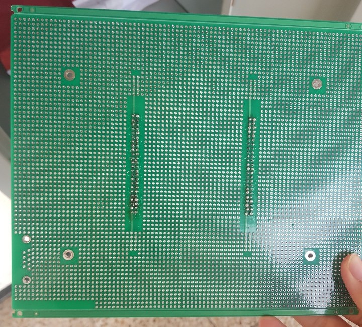
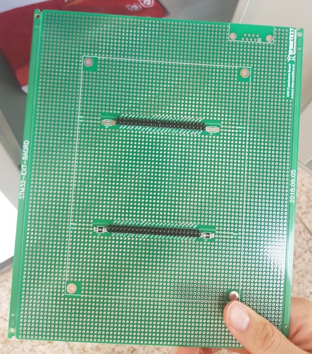

# 2019년 2학기 수요일분반

# 임베디드 시스템 설계 및 실험 보고서

# 1조 6주차


---


# 개요
이번 실험은 NVIC와 EXTI를 이용하여 인터럽트 방식을 활용한 GPIO 제어, UART 통신을 진행하였다. 

## 목표
1. Interrupt 방식을 활용한 GPIO 제어 및 UART 통신
2. 라이브러리 함수 사용법 숙지
3. 보드 납떔

## 세부실험내용
1. NVIC와 EXTI를 이용하여 GPIO 선에 인터럽트 핸들링 세팅 
2. USART1 설정 
3. 조이스틱 이벤트를 인터럽트로 받는 프로그램 작성
- 조이스틱 Left : LED 4 점멸 반복
- 조이스틱 Right : LED 1 점멸 반복
- 조이스틱 Select : LED All OFF
- User S1 버튼(PD11)을 누를 경우 Putty로 “TEAMXX\r\n“ 출력
4. Putty를 통해 입력받아 동작
- ‘u‘+’p‘ 연속 문자 받을시 아래서 위로 led 순서대로 켜지기 반복
- ‘d’+‘n’ 연속 문자 받을시 위에서 아래로 led 순서대로 켜지기 반복


# 개념

CPU가 이벤트를 처리하는 방식에는 Polling과 Interrup 2가지 방식이 있다. 

## Polling

폴링은 cpu가 특정 이벤트의 발생을 처리하기위해 특정 주기마다 신호가 입력되었는지 검사하는 방식이다.

*장점*

구현이쉽다

*단점* 

시스템성능 저하를 일으킨다.


## Interrupt

인터럽트는 CPU가 다른 연산을 수행하고있어도 이벤트가 발생하면 해당 인터럽트 서비스 루틴을 수행하는 방식이다.

*장점*

처리가 정확하고 시스템부하를 줄일 수 있다.

*단점*

구현이 복잡하다. 

### Interrupt의 종류

#### SoftwareInterrupt

사용자가 프로그램내에서 interrupt가 발생하도록 설정하는것이다. 즉, 현재 실행하고 있는 instruction으로부터 interrupt 발생 요청을 받는다. 내부 인터럽트라고도 한다.

#### HardwareInterrupt

비동기식 이벤트처리로 peripheral(주변장치)의 요청에 의해 발생하는 interrupt이다. 외부 인터럽트라고도 한다.


# 세팅

## 만능기판 납땜

Cortex-M3를 부착할 수 있는 기판이다. 만능기판에 핀을 납땜하여 보드를 부착할 수 있게 하였다. 추후 센서와 같은 모듈들을 기판에 부착하여 깔끔하게 구현할 수 있다.






# 구현

## EXTI

> External Interrupt/Event Controller

외부 인터럽트, 즉 하드웨어 인터럽트 이벤트를 처리하는 컨트롤러이다.


## NVIC

> Nested Vectored Interrupt Controller

중첩된 인터럽트를 제어하는 컨트롤러이다. 여러 Exception들에 대해 우선순위를 설정하고 해당 우선순위에 따라서 중첩된 interrupt를 처리한다.


## 전체코드
``` c
#include "stm32f10x.h"
#include "stm32f10x_gpio.h"
#include "stm32f10x_exti.h"
#include "stm32f10x_rcc.h"
#include "stm32f10x_usart.h"
#include "misc.h"
#include "core_cm3.h"

int sw_state = 0;
int ua_state = 0;
int i, j;
char data[8] = {'T', 'E', 'A', 'M', '0', '1', '\r', '\n'};

void delay(){
   for(j=0; j<1000000; ++j);
}


void RCC_Configure() {

   RCC_APB2PeriphClockCmd(RCC_APB2Periph_AFIO, ENABLE);
   /*TODO : APB2PeriphClockEnable */
   RCC_APB2PeriphClockCmd(RCC_APB2Periph_GPIOA, ENABLE);
   RCC_APB2PeriphClockCmd(RCC_APB2Periph_GPIOB, ENABLE);
   RCC_APB2PeriphClockCmd(RCC_APB2Periph_GPIOC, ENABLE);
   RCC_APB2PeriphClockCmd(RCC_APB2Periph_GPIOD, ENABLE);
   RCC_APB2PeriphClockCmd(RCC_APB2Periph_USART1, ENABLE);


}
void GPIO_Configure() {

   GPIO_InitTypeDef GPIO_InitStructure_LED;
   GPIO_InitTypeDef GPIO_InitStructure_USART1TX;
   GPIO_InitTypeDef GPIO_InitStructure_USART1RX;
   GPIO_InitTypeDef GPIO_InitStructure_JOY;
   GPIO_InitTypeDef GPIO_InitStructure_JOYS;
   GPIO_InitTypeDef GPIO_InitStructure_BUTTON;

   // LED 세팅
   GPIO_InitStructure_LED.GPIO_Mode = GPIO_Mode_Out_PP;
   GPIO_InitStructure_LED.GPIO_Pin = (GPIO_Pin_2 | GPIO_Pin_3 | GPIO_Pin_4 | GPIO_Pin_7);
   GPIO_InitStructure_LED.GPIO_Speed = GPIO_Speed_50MHz;
   GPIO_Init(GPIOD, &GPIO_InitStructure_LED);

   /*TODO: USART1, JoyStick Config */

   // USART1 TX 세팅
   GPIO_InitStructure_USART1TX.GPIO_Mode = GPIO_Mode_AF_PP;
   GPIO_InitStructure_USART1TX.GPIO_Pin = (GPIO_Pin_9);
   GPIO_InitStructure_USART1TX.GPIO_Speed = GPIO_Speed_50MHz;
   GPIO_Init(GPIOA, &GPIO_InitStructure_USART1TX);

   // USART1 RX 세팅
   GPIO_InitStructure_USART1RX.GPIO_Mode = GPIO_Mode_IPD;
   GPIO_InitStructure_USART1RX.GPIO_Pin = (GPIO_Pin_10);
   GPIO_InitStructure_USART1RX.GPIO_Speed = GPIO_Speed_50MHz;
   GPIO_Init(GPIOA, &GPIO_InitStructure_USART1RX);

   // 조이스틱 좌우 세팅
   GPIO_InitStructure_JOY.GPIO_Mode = GPIO_Mode_IPD;
   GPIO_InitStructure_JOY.GPIO_Pin = (GPIO_Pin_3 | GPIO_Pin_4);
   GPIO_InitStructure_JOY.GPIO_Speed = GPIO_Speed_50MHz;
   GPIO_Init(GPIOC, &GPIO_InitStructure_JOY);

   // 조이스틱 선택 세팅
   GPIO_InitStructure_JOYS.GPIO_Mode = GPIO_Mode_IPD;
   GPIO_InitStructure_JOYS.GPIO_Pin = (GPIO_Pin_8);
   GPIO_InitStructure_JOYS.GPIO_Speed = GPIO_Speed_50MHz;
   GPIO_Init(GPIOB, &GPIO_InitStructure_JOYS);

   // 버튼 세팅
   GPIO_InitStructure_BUTTON.GPIO_Mode = GPIO_Mode_IPD;
   GPIO_InitStructure_BUTTON.GPIO_Pin = (GPIO_Pin_11);
   GPIO_InitStructure_BUTTON.GPIO_Speed = GPIO_Speed_50MHz;
   GPIO_Init(GPIOD, &GPIO_InitStructure_BUTTON);

   /*TODO: GPIO EXTILineConfig*/
   GPIO_EXTILineConfig(GPIO_PortSourceGPIOC, GPIO_PinSource3);
   GPIO_EXTILineConfig(GPIO_PortSourceGPIOC, GPIO_PinSource4);
   GPIO_EXTILineConfig(GPIO_PortSourceGPIOB, GPIO_PinSource8);
   GPIO_EXTILineConfig(GPIO_PortSourceGPIOD, GPIO_PinSource11);


}

void USART_Configure() {
   /*TODO: USART1 configuration*/
   USART_InitTypeDef USART_InitStructure;

   USART_InitStructure.USART_BaudRate = 9600;
   USART_InitStructure.USART_HardwareFlowControl = USART_HardwareFlowControl_None;
   USART_InitStructure.USART_Mode = USART_Mode_Rx | USART_Mode_Tx;
   USART_InitStructure.USART_Parity = USART_Parity_No;
   USART_InitStructure.USART_StopBits = USART_StopBits_1;
   USART_InitStructure.USART_WordLength = USART_WordLength_8b;

   USART_Init(USART1, &USART_InitStructure);

   /*TODO: USART1 cmd ENABLE*/
   USART_Cmd(USART1, ENABLE);

   /*TODO: USART1 IT Config*/
   USART_ITConfig(USART1, USART_IT_RXNE, ENABLE);
}

void EXTI_Configure() {
   /*TODO: EXTI configuration [ mode interrupt ] [Trigger_falling] */
   EXTI_InitTypeDef EXTI_InitStructure_LEFT;
   EXTI_InitTypeDef EXTI_InitStructure_RIGH;
   EXTI_InitTypeDef EXTI_InitStructure_SELE;
   EXTI_InitTypeDef EXTI_InitStructure_BUTT;

   EXTI_InitStructure_LEFT.EXTI_Line = EXTI_Line3;  // 왼쪽
   EXTI_InitStructure_LEFT.EXTI_LineCmd = ENABLE;
   EXTI_InitStructure_LEFT.EXTI_Mode = EXTI_Mode_Interrupt;
   EXTI_InitStructure_LEFT.EXTI_Trigger = EXTI_Trigger_Falling;
   EXTI_Init(&EXTI_InitStructure_LEFT);

   EXTI_InitStructure_RIGH.EXTI_Line = EXTI_Line4; // 오른쪽
   EXTI_InitStructure_RIGH.EXTI_LineCmd = ENABLE;
   EXTI_InitStructure_RIGH.EXTI_Mode = EXTI_Mode_Interrupt;
   EXTI_InitStructure_RIGH.EXTI_Trigger = EXTI_Trigger_Falling;
   EXTI_Init(&EXTI_InitStructure_RIGH);

   EXTI_InitStructure_SELE.EXTI_Line = EXTI_Line8; // 선택
   EXTI_InitStructure_SELE.EXTI_LineCmd = ENABLE;
   EXTI_InitStructure_SELE.EXTI_Mode = EXTI_Mode_Interrupt;
   EXTI_InitStructure_SELE.EXTI_Trigger = EXTI_Trigger_Falling;
   EXTI_Init(&EXTI_InitStructure_SELE);

   EXTI_InitStructure_BUTT.EXTI_Line = EXTI_Line11; // 버튼
   EXTI_InitStructure_BUTT.EXTI_LineCmd = ENABLE;
   EXTI_InitStructure_BUTT.EXTI_Mode = EXTI_Mode_Interrupt;
   EXTI_InitStructure_BUTT.EXTI_Trigger = EXTI_Trigger_Falling;
   EXTI_Init(&EXTI_InitStructure_BUTT);
}

void NVIC_Configure() {
   /*TODO: NVIC_configuration */
   NVIC_InitTypeDef NVIC_InitStructure_LEFT;
   NVIC_InitTypeDef NVIC_InitStructure_RIGH;
   NVIC_InitTypeDef NVIC_InitStructure_SELE;
   NVIC_InitTypeDef NVIC_InitStructure_BUTT;
   NVIC_InitTypeDef NVIC_InitStructure_UART;

   NVIC_PriorityGroupConfig(NVIC_PriorityGroup_2);

   NVIC_InitStructure_LEFT.NVIC_IRQChannel = EXTI3_IRQn;
   NVIC_InitStructure_LEFT.NVIC_IRQChannelCmd = ENABLE;
   NVIC_InitStructure_LEFT.NVIC_IRQChannelPreemptionPriority = 0x00;
   NVIC_InitStructure_LEFT.NVIC_IRQChannelSubPriority = 0x00;
   NVIC_Init(&NVIC_InitStructure_LEFT);

   NVIC_InitStructure_RIGH.NVIC_IRQChannel = EXTI4_IRQn;
   NVIC_InitStructure_RIGH.NVIC_IRQChannelCmd = ENABLE;
   NVIC_InitStructure_RIGH.NVIC_IRQChannelPreemptionPriority = 0x01;
   NVIC_InitStructure_RIGH.NVIC_IRQChannelSubPriority = 0x00;
   NVIC_Init(&NVIC_InitStructure_RIGH);

   NVIC_InitStructure_SELE.NVIC_IRQChannel = EXTI9_5_IRQn;
   NVIC_InitStructure_SELE.NVIC_IRQChannelCmd = ENABLE;
   NVIC_InitStructure_SELE.NVIC_IRQChannelPreemptionPriority = 0x02;
   NVIC_InitStructure_SELE.NVIC_IRQChannelSubPriority = 0x00;
   NVIC_Init(&NVIC_InitStructure_SELE);

   NVIC_InitStructure_BUTT.NVIC_IRQChannel = EXTI15_10_IRQn;
   NVIC_InitStructure_BUTT.NVIC_IRQChannelCmd = ENABLE;
   NVIC_InitStructure_BUTT.NVIC_IRQChannelPreemptionPriority = 0x03;
   NVIC_InitStructure_BUTT.NVIC_IRQChannelSubPriority = 0x00;
   NVIC_Init(&NVIC_InitStructure_BUTT);

   NVIC_InitStructure_UART.NVIC_IRQChannel = USART1_IRQn;
   NVIC_InitStructure_UART.NVIC_IRQChannelCmd = ENABLE;
   NVIC_InitStructure_UART.NVIC_IRQChannelPreemptionPriority = 0x01;
   NVIC_InitStructure_UART.NVIC_IRQChannelSubPriority = 0x00;
   NVIC_Init(&NVIC_InitStructure_UART);

}


/*TODO: IRQHandler */
void EXTI3_IRQHandler(){
   if(EXTI_GetITStatus(EXTI_Line3) != RESET){
      sw_state = 1;
      EXTI_ClearITPendingBit(EXTI_Line3);
   }
}

void EXTI4_IRQHandler(){
   if(EXTI_GetITStatus(EXTI_Line4) != RESET){
      sw_state = 2;
      EXTI_ClearITPendingBit(EXTI_Line4);
   }
}

void EXTI9_5_IRQHandler(){
   if(EXTI_GetITStatus(EXTI_Line8) != RESET){
      sw_state = 0;
      EXTI_ClearITPendingBit(EXTI_Line8);
   }
}

void EXTI15_10_IRQHandler(){
   if(EXTI_GetITStatus(EXTI_Line11) != RESET){
      sw_state = -1;
      EXTI_ClearITPendingBit(EXTI_Line11);
   }
}

void USART1_IRQHandler(){
   char c;
   if(USART_GetITStatus(USART1, USART_IT_RXNE) != RESET){
      c = USART_ReceiveData(USART1);

      switch(c){
      case 'u':
         if(ua_state == 0) ua_state = 1;
         else ua_state = 0;
         break;
      case 'p':
         if(ua_state == 1)
            sw_state = 3;
         ua_state = 0;
         break;
      case 'd':
         if(ua_state == 0) ua_state = 2;
         else ua_state = 0;
         break;
      case 'n':
         if(ua_state == 2)
            sw_state = 4;
         ua_state = 0;
         break;
      default:
         ua_state = 0;
      }
   }
}


int main() {
   SystemInit();
   RCC_Configure();
   GPIO_Configure();
   USART_Configure();
   EXTI_Configure();
   NVIC_Configure();

   //GPIO_SetBits(GPIOD, GPIO_Pin_2);
   //GPIO_SetBits(GPIOD, GPIO_Pin_7);
   while(1){
      switch(sw_state){
      case 0: // 선택
         break;

      case 1: // 왼쪽
         GPIO_SetBits(GPIOD, GPIO_Pin_2);
         delay();
         GPIO_ResetBits(GPIOD, GPIO_Pin_2);
         delay();
         break;

      case 2: // 오른쪽
         GPIO_SetBits(GPIOD, GPIO_Pin_7);
         delay();
         GPIO_ResetBits(GPIOD, GPIO_Pin_7);
         delay();
         break;

      case -1: // TX 보내기
         for(i=0; i!=8; ++i){  // 버튼
            USART_SendData(USART1, data[i]);
            delay();
         }
         sw_state = 0;
         break;

      case 3:
         GPIO_ResetBits(GPIOD, GPIO_Pin_7);
         GPIO_SetBits(GPIOD, GPIO_Pin_2);
         delay();

         GPIO_ResetBits(GPIOD, GPIO_Pin_2);
         GPIO_SetBits(GPIOD, GPIO_Pin_3);
         delay();

         GPIO_ResetBits(GPIOD, GPIO_Pin_3);
         GPIO_SetBits(GPIOD, GPIO_Pin_4);
         delay();

         GPIO_ResetBits(GPIOD, GPIO_Pin_4);
         GPIO_SetBits(GPIOD, GPIO_Pin_7);
         delay();
         break;

      case 4:
         GPIO_ResetBits(GPIOD, GPIO_Pin_2);
         GPIO_SetBits(GPIOD, GPIO_Pin_7);
         delay();

         GPIO_ResetBits(GPIOD, GPIO_Pin_7);
         GPIO_SetBits(GPIOD, GPIO_Pin_4);
         delay();

         GPIO_ResetBits(GPIOD, GPIO_Pin_4);
         GPIO_SetBits(GPIOD, GPIO_Pin_3);
         delay();

         GPIO_ResetBits(GPIOD, GPIO_Pin_3);
         GPIO_SetBits(GPIOD, GPIO_Pin_2);
         delay();
         break;
      }

   }
}
```


# 결론

박성수: 헤더 파일에서 제공하는 구조체를 가지고 인터럽트를 세팅하고, 발생하는 EXTI, NVIC 실습을 진행하였다. 처음에 EXTI가 어느 핀에서 발생하는지도 모르고 다른 핀에 할당하려다 조교님의 도움으로 찾을 수 있었고, NVIC 함수도 어셈블리어 파일에서 찾는 것도 알게 되었다. 코딩 자체는 어렵지 않았지만 C 프로젝트를 생성해야 했었는데, 그 부분을 못봐서 C++ 프로젝트로 작업해서 일정 시간이 지난 후에 보드가 중단되는 문제가 발생했다. 이 부분 때문에 코드를 완성했는데도 4시간 넘게 지체되었는데, 다음에 이런 일이 없어야겠다.

김금보: 이전 실험까지는 폴링방식을 이용하여 인풋을 주엇다면 이번에는 인터럽트 방식을 사용하여 인풋값을 주엇다. 실험 내내 코드가 잘못된건 없어 보이지만 잘 작동하지 않아 시간을 많이 잡아먹엇는데 프로젝트 생성을 c가 아닌 c++프로젝트로 만들엇다는걸 알때는 정말 허탈하엿다.  실험 중 다음 실험에 사용할 보드에 납땜을 하엿는데 납땜을 하는 동안 실험에 참여하지 못하고 흐름을 놓쳐버려 조금 아쉬웟다.

김승현: 이번 실험에서는 하드웨어 인터럽트를 사용하여 버튼 이벤트 처리와 USART 통신을 하였다. 지금까지는 loop를 돌려 폴링방식으로 버튼 이벤트를 처리했다면 이제는 EXTI를 통해 하드웨어 인터럽트 방식으로 이벤트를 처리할 수 있게 되었다. 또 라이브러리의 헤더파일에 적혀있는 주석을 통해 어떤 함수와 상수를 사용해야 하는지 알 수 있었다. 전반적으로 상수의 사용과 기능적으로 코드를 분리하여 작성하니 가독성이 매우 높아졌다.  